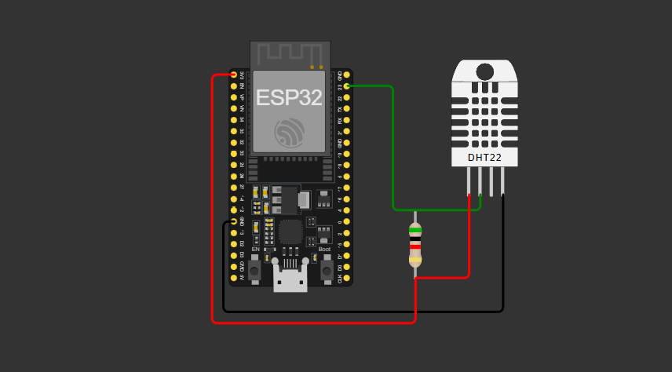

# 🔌 ESP32 Firmware

This folder contains the C++ code for the ESP32 microcontroller. It handles sensor reading and data transmission to Firebase.

## 🛠️ Hardware Setup

### Wiring Diagram

| DHT11 Pin | ESP32 Pin |
| :--- | :--- |
| **VCC** | 3.3V |
| **GND** | GND |
| **DATA** | GPIO 23 (D23) |

<p align="center">
    
</p>

## ⚙️ Configuration

1. **LIBRARIES**: Ensure you have these installed in your IDE:

    * `Firebase ESP32 Client` (by Mobizt)
    * `DHT sensor library` (by Adafruit)

2. **CREDENTIALS**: Open the source file and update:

    ```cpp
    #define WIFI_SSID "YOUR_SSID"
    #define WIFI_PASSWORD "YOUR_PASSWORD"
    #define FIREBASE_HOST "your-project.firebaseio.com"
    #define FIREBASE_AUTH "your_database_secret"
    ```

## 🔥 Firebase Credentials & Setup Guide

This guide covers how to obtain the necessary credentials for both the Flutter Mobile App and the ESP32 Firmware.

### 📱 FOR FLUTTER (Android/iOS)

**Step 1: Access Firebase Console**

1. Go to [Firebase Console](https://console.firebase.google.com/).

2. Select your project (or create a new one).

**Step 2: Add Flutter Apps (Android Configuration)**

1. Click the **Android** icon (green robot) on the Project Overview page.

2. **Package Name**: Enter your ID (e.g., `com.yourcompany.esp32app`).

    * Find it in: ``android/app/build.gradle`` → ``applicationId``.

3. **Register App** and download ``google-services.json``.

4. **Move the file** to: ``android/app/google-services.json``.

### 🌡️ FOR REALTIME DATABASE (ESP32)

**Step 1: Get Database URL**

1. In the Firebase Console, go to **Build** → **Realtime Database**.

2. Click **Create Database**, select a location, and choose **Start in test mode**.

3. Copy the URL: ``https://your-project-default-rtdb.firebaseio.com/``.

    ✅ This is your **FIREBASE_HOST**.

**Step 2: Get API Key (Authentication)**

Firebase now uses Web API Keys for security.

1. Go to **Project Settings** (Gear icon) → **General**.

2. Copy the **Web API Key**.

    ✅ This is your **FIREBASE_AUTH**.

### 🔐 SECURITY RULES

To allow the ESP32 to write data, update your Database Rules:

**Development Mode (Public):**

````JSON
{
  "rules": {
    ".read": true,
    ".write": true
  }
}
````

*⚠️ Warning: Only use this for testing.*

## 🚀 Flashing

1. Open the project in **PlatformIO** (recommended) or Arduino IDE.
2. Connect your ESP32 via USB.
3. Build and Upload.
4. Check the **Serial Monitor** (115200 baud) to verify the Firebase connection.
