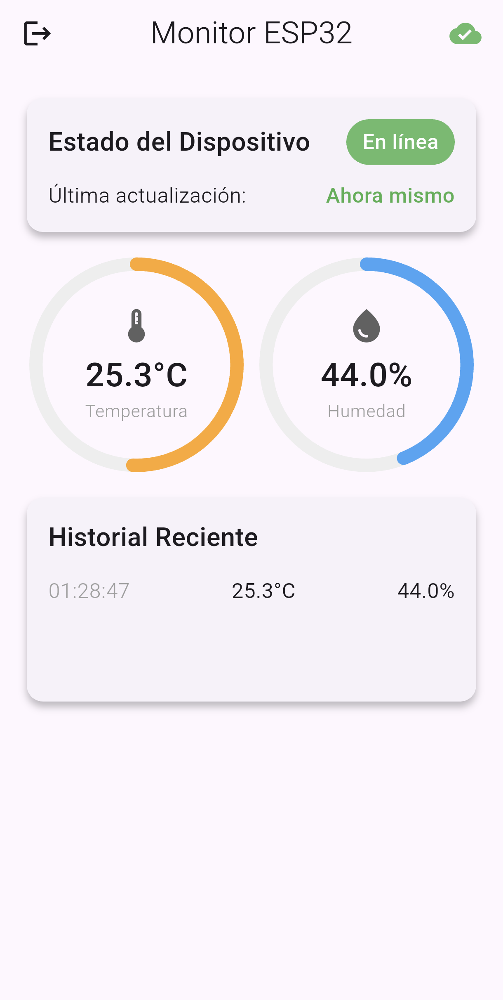

# 📱 ESP32 Temperature & Humidity Monitor (Flutter App)

This is the mobile application component of the IoT monitoring system. It provides real-time visualization of data sent by an ESP32 via Firebase Realtime Database, featuring secure Google authentication and a reactive dashboard.

## ✨ Key Features

* **Secure Authentication**: Integrated with **Google Sign-In** and **Firebase Auth**.

* **Real-time Dashboard**: Reactive UI that updates instantly when the ESP32 sends new data using ``StreamSubscription``.

* **Dynamic Visualizations**: Custom-painted circular gauges with color-coded temperature ranges.

* **Connectivity Monitoring**: Heartbeat system that detects if the ESP32 is offline (checks if data is older than 30 seconds).

* **Historical Data**: List view showing the last 10 readings stored in local state.

## 🏗️ Project Architecture

The app follows a modular structure:

1. ``main.dart``: Entry point, initializes Firebase and sets the global theme.

2. ``login_screen.dart``: Handles OAuth2 flow with Google and Firebase credential exchange.

3. ``dashboard.dart``: The core logic. Manages Realtime Database streams, animations, and device status.

4. ``firebase_options.dart``: Auto-generated configuration for Firebase services.

## 📸 Screenshots

<p align="center">
    
</p>

## 🚀 Getting Started

### Prerequisites

* Flutter SDK installed..
* A Firebase Project with Google Auth and Realtime Database enabled.
* ``google-services.json`` placed in the Android folder.

### Dependencies

This project uses the following plugins:

````YAML
dependencies:
  firebase_core: latest
  firebase_auth: latest
  firebase_database: latest
  google_sign_in: latest
  intl: ^0.19.0
````

### Installation

1. **Enter the Flutter project:**

```bash
cd mobile-app/
```

2. **Get packages**

````bash
flutter pub get
````

3. **Configure Firebase:**

Use FlutterFire CLI to link your project:

```bash
flutterfire configure
```

4. **Run the app:**

````bash
flutter run
````

## 🛠️ Technical Implementation Details

### **Data Flow**

The app listens to the ``/lecturas`` node in Firebase. The data structure expected from the ESP32 is:

````JSON
{
  "temperatura": 25.5,
  "humedad": 40.0
}
````

### **Custom Gauges**

Instead of using heavy third-party libraries, the dashboard uses a CustomPainter (``_CircleProgressPainter``) to render smooth, lightweight animations for the sensors.

### **Device Status Logic**

The app implements a ``Timer.periodic`` that compares the current time with the last received timestamp. If the difference exceeds **30 seconds**, the status indicator changes from **"En línea"** (Green) to **"Apagado"** (Red).

## 🔒 Security Rules (Database)

For this app to work with Auth, ensure your Firebase Rules allow authenticated users:

````JSON
{
  "rules": {
    "lecturas": {
      ".read": "auth != null",
      ".write": true 
    }
  }
}
````

*(Note: ``.write`` is set to true for the ESP32 to send data without a user token, but restricted ``.read`` protects user privacy in the app).*

## 📄 License

This project is licensed under the MIT License - see the LICENSE file for details.

## 🤝 Contributing

If you'd like to contribute to this project, feel free to submit a pull request. Please make sure your code follows the existing style and includes appropriate comments.

1. Fork the repository.
2. Create a new branch for your feature or bug fix.
3. Commit your changes.
4. Push to the branch.
5. Submit a pull request.

## 👤 Author

**Carlos Antonio Martinez Miranda**

GitHub: [@CarlosM1024](https://github.com/CarlosM1024)
